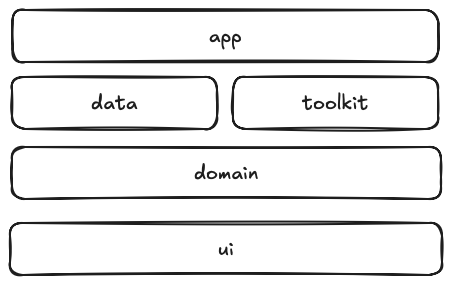

# Overview: Baselines Blueprint

This document provides a high-level overview of the Kotlin Multiplatform (KMP) mobile starter kit, with a focus on
its architecture, modular layer design, and how the key components work together.

The goal is to help technical stakeholders — such as developers, CTOs, and engineering managers — understand
how the project is structured and why it’s built this way. Whether you’re onboarding new engineers or
evaluating the architecture for scale, this guide outlines the major layers, patterns, and flow of control
throughout the codebase.

This starter kit is designed to accelerate development of cross-platform mobile apps for Android and iOS.
It comes bundled with essential libraries, integrations, and tooling pre-configured, allowing teams to immediately
begin building MVPs, prototypes, or production-ready apps without spending time on infrastructure setup.

The architecture has been proven in real-world, large-scale projects and is structured to support long-term growth,
maintainability, and team collaboration across platforms.

# Project Blueprint

## Environment

- **Primary IDE**: Android Studio (recommended for Compose tooling + multiplatform support)
- **iOS Module**: Should be opened in Xcode for building/running on simulators/devices
- **Plugin requirements** (for Android Studio):
    - ✅ [Kotlin Multiplatform](https://plugins.jetbrains.com/plugin/14936-kotlin-multiplatform)
    - ✅ Bundled Compose Multiplatform plugin
    - ✅ [SQLDelight IDE Support](https://plugins.jetbrains.com/plugin/8191-sqldelight)

## Build System

The project uses **Gradle** for configuration and dependency management:

- 🔁 **Reusable build logic** is centralized under:

  `gradle/build-logic/convention/*`

- 📦 **Dependency versions** are managed
  using [Version Catalogs](https://docs.gradle.org/current/userguide/version_catalogs.html):

  `gradle/libs.versions.toml`

This setup promotes consistency and avoids boilerplate duplication across modules.

## Structure

This Kotlin Multiplatform (KMP) project is inspired by clean architecture and follows a modular, layered architecture
designed around **separation of concerns**, **scalability**, and **cross-platform code reuse**. It enables fast
iteration during early MVP stages while ensuring a maintainable structure for long-term growth.

It consists of the following functional layers:

- **app**: Platform-specific entry points and bootstrapping logic:
    - android — Android target module
    - ios — iOS target module
    - compose — shared KMP app entry point (used by both platforms)
- **ui**: Composable screens, navigation, UI state models, design system
- **domain**: Business logic, domain models, and use-case workers
- **data**: Repositories, local and remote data sources, persistence
- **toolkit**: Internal libraries, utility wrappers, logger, DI qualifiers, coroutines, etc.

    

## **Dependencies & Technologies**

This project is powered by a curated set of technologies designed for rapid, scalable Kotlin Multiplatform (KMP)
development. The stack includes build tools, multiplatform libraries, UI frameworks, data layers, and
system utilities — all versioned centrally
via [Gradle Version Catalogs](https://docs.gradle.org/current/userguide/version_catalogs.html) in
gradle/libs.versions.toml.

### **⚙️Core Kotlin Tooling**

| **Library / Plugin**          | **Purpose**                                        |
|-------------------------------|----------------------------------------------------|
| kotlinx-serialization         | Kotlinx Serialization support                      |
| kotlinx-coroutines-core       | Asynchronous programming with coroutines           |
| kotlinx-datetime              | Cross-platform date and time utilities             |
| kotlinx-collections-immutable | Immutable collection types for safe state modeling |

### **💉 Dependency Injection**

| **Library**   | **Purpose**                                      |
|---------------|--------------------------------------------------|
| kotlin-inject | Lightweight compile-time DI for KMP using ksp    |
| ksp           | Kotlin Symbol Processing for generating DI graph |

### **🎨 UI (Compose Multiplatform)**

| **Library**                                                        | **Purpose**                              |
|--------------------------------------------------------------------|------------------------------------------|
| lifecycle-viewmodel-compose, lifecycle-runtime-compose (jetbrains) | ViewModel support in Compose             |
| navigation-compose (jetbrains)                                     | Declarative navigation with Compose      |
| material3 (jetbrains)                                              | Material3 components and theming support |

### **📦 Data Layer**

| **Library**                | **Purpose**                                          |
|----------------------------|------------------------------------------------------|
| androidx.datastore         | Key-value storage via DataStore Preferences          |
| app.cash.sqldelight:*      | Type-safe SQL database generation (Android + Native) |
| net.zetetic:sqlcipher      | Encrypted DB support for iOS and Android             |
| androidx.sqlite:sqlite     | Android SQLite driver                                |
| co.touchlab:sqliter-driver | Native SQLite driver (iOS/KMP)                       |

### **🌐 Networking**

| **Library**        | **Purpose**                     |
|--------------------|---------------------------------|
| ktor-client-core   | Core HTTP client engine         |
| ktor-client-okhttp | Android client backend (OkHttp) |
| ktor-client-darwin | iOS client backend              |

### **📋 Logging**

| **Library**        | **Purpose**                                  |
|--------------------|----------------------------------------------|
| co.touchlab:kermit | Lightweight cross-platform logging framework |
