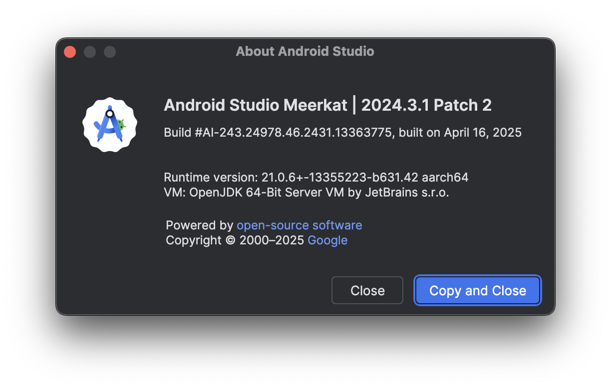
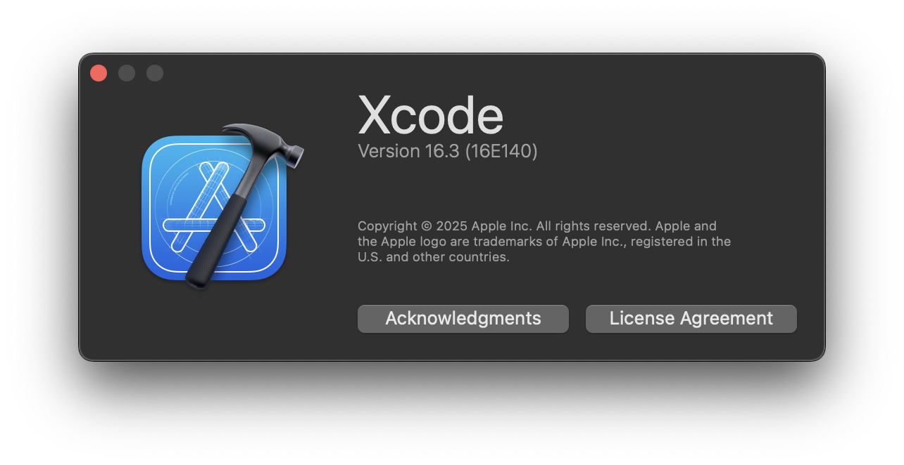
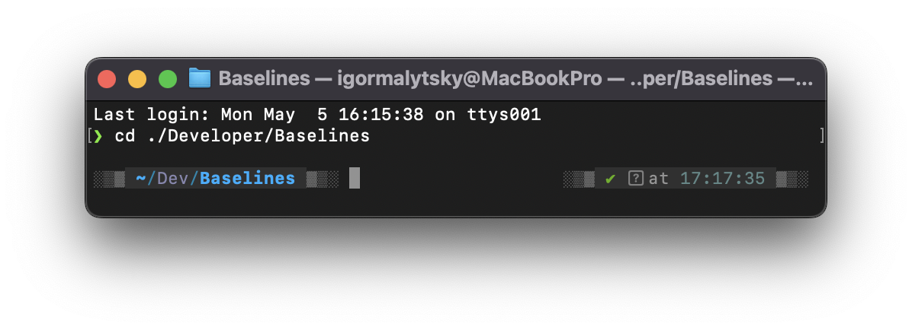
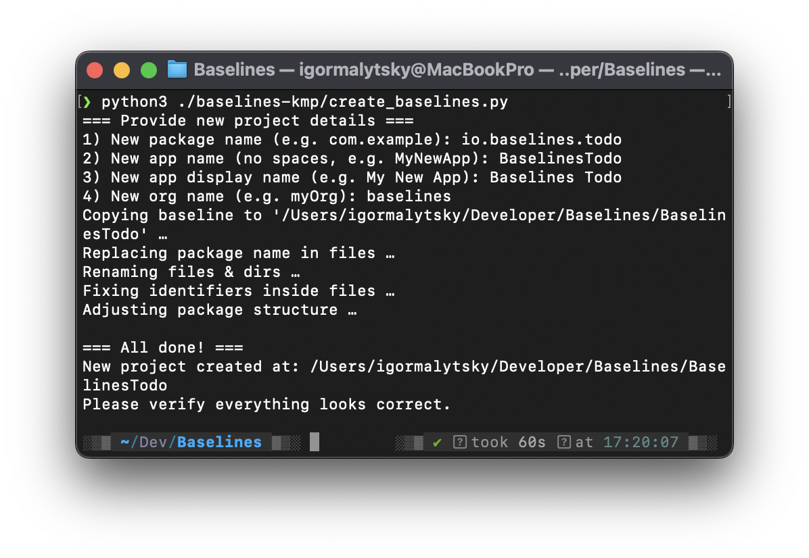
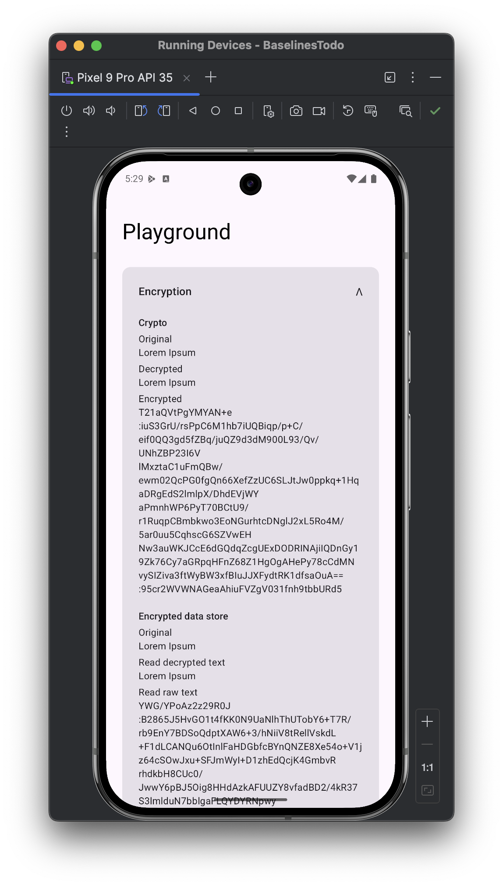
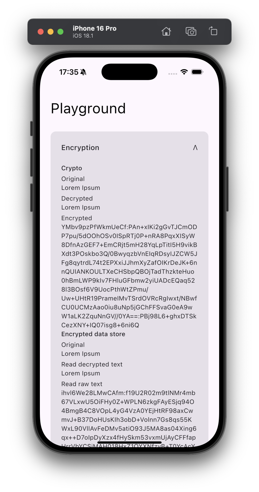

# Get Started

## **Overview**

The **baselines.io Starter Kit** delivers a ready-to-use Kotlin Multiplatform workspace. Full package of
the starter kit saves you roughly **four weeks** of repetitive setup work. What you get out of the box:

- **Shared code across mobile platforms** – a single commonMain powering Android *and* iOS.
- **Simplified & unified build scripts** – one Gradle version catalog and convention plugins instead of per‑module
  boilerplate.
- **Opinionated architecture with integrated best practices** – scalable layer separation, feature modules, and
  testability hooks.
- **Dependency Injection via `kotlin‑inject`** – compile‑time DI with zero reflection.
- **Navigation, design system, app initializers, sample Playground screen, and more** – so you can start coding features
  immediately.

This guide walks you through generating a new project, verifying the build in Android Studio and Xcode, and highlights
common pitfalls.

## Prerequisites

| Tool / SDK         | Minimum Version          | Notes                                                        |
|--------------------|--------------------------|--------------------------------------------------------------|
| **macOS**          | 13 Ventura               | Required for iOS builds. Linux/Win OK for Android‑only.      |
| **Python**         | 3.9+                     | Needed to run the generator script. Run `python3 --version`. |
| **Git**            | any recent               | Clone/keep your project under version control.               |
| **Android Studio** | latest                   | Install Android SDK 35.                                      |
| **Xcode**          | latest                   | iOS 15.3 SDK.                                                |
| Command‑line tools | `git`, `python3`, `bash` | Pre‑installed on macOS.                                      |

<p align="center">
    
</p>

<p align="center">
    
</p>

## **Quick Start (TL;DR)**

```bash
# 1. Move into a workspace directory
cd ~/projects
# 2. Run the generator
python3 path/to/baselines-kmp/create_baselines.py
# 3. Open in IDEs & Run
open -a "Android Studio" ./MyApp
open ./MyApp/app/ios/MyApp/MyApp.xcodeproj
```

## Step‑by‑Step Alternative

### 1. Choose a location

Open **Terminal.app** (or iTerm) and `cd` into the folder that will host the new repo (e.g. `~/Projects`).

<p align="center">
    
</p>

### 2 Launch the generator script

Run:

```bash
python3 path/to/baselines-kmp/create_baselines.py
```

The script will prompt for:

| Prompt           | Description                                           | Example             |
|------------------|-------------------------------------------------------|---------------------|
| **Package name** | Reverse‑DNS style. Used for Android & iOS bundle IDs. | `io.baselines.todo` |
| **Project name** | Code‑friendly identifier (no spaces).                 | `BaselinesTodo`     |
| **Display name** | User‑facing name under the icon.                      | `Baselines Todo`    |
| **Organization** | Shown in copyright, Apple signing, etc.               | `baselines`         |

<p align="center">
    
</p>

### 3 Open & run the Android project

Open the project in your IDE (e.g. Android Studio)

```bash
open -a "Android Studio" ./BaselineTodo
```

Let Gradle sync (~1 min on first run). While syncing, connect a device or start an emulator. Then click ▶ **Run**
on the `app.android` configuration.

The **Playground** screen should appear.

<p align="center">
    
</p>

### 4 Open & run the iOS project

Open the project in XCode.

```bash
open ./BaselinesTodo/app/ios/BaselinesTodo/BaselinesTodo.xcodeproj
```

Wait until project is ready to start, then click ▶︎ **Run**.

The **Playground** screen should appear.

<p align="center">
    
</p>

If Xcode complains about signing:

- Make sure **Signing & Capabilities → Team** is set to *None* (Debug) or your Apple ID (Release signing).

> Troubleshoot: "Could not infer iOS target architectures" ➜ open the workspace from Xcode, not the CLI‑generated root.
>

## **Directory Structure (generated)**

```
<root>
├─ .github/                 # CI workflows
│
├─ app/                     # Platform launchers (android/, ios/)
│   ├─ android/                # Android entry‑point
│   ├─ compose/                # Shared app code (included to android/ and ios/)
│   └─ ios/                    # iOS entry-point
│
├─ data/                    # Data‑layer source‑set
│   ├─ database-delight/       # SQLDelight DB + migrations
│   └─ http-ktor/              # Ktor client + configs
│
├─ domain/                  # Pure business logic
│
├─ toolkit/                 # Utility libraries
│   ├─ config/                 # App configs: platform, debug flags, etc.
│   ├─ coroutines/             # Coroutine helpers
│   ├─ crypto/                 # Encryption APIs
│   ├─ data‑store/             # Key-value storage APIs
│   ├─ di/                     # `kotlin‑inject` helpers
│   ├─ initializer/            # App/features initialization API
│   ├─ logger/                 # Kermit + crash logging sinks
│   └─ time/                   # Kotlinx time helper functions
│
├─ ui/                      # Presentation layer (Compose Multiplatform)
│   ├─ design‑system/          # Theme, typography, atoms, molecules
│   ├─ home/                   # Stub feature module
│   ├─ navigation/             # Route registry & transitions
│   ├─ playground/             # App playground, demos
│   └─ view‑model/             # Base ViewModel / state holders
│
├─ gradle/                  # Version catalogs, build convention plugins
│   └─ build-logic/            # Convention plugins & app versions accessors
│
├─ .editorconfig            # Formatting rules
├─ .gitignore               # VCS ignores
├─ build.gradle.kts         # Root Gradle script
├─ compose-stability.conf   # Jetpack Compose compiler opts
├─ gradle.properties        # JVM & project‑wide flags
└─ settings.gradle.kts      # Module includes & pluginManagement
```

### **Creating a New Feature Screen**

You can follow this mini‑guide whenever you need to add a new screen to your baselines‑powered app.

1. **Install / verify the *UI Feature* template**

   *Android Studio →* **File › Manage IDE Settings › Import Settings…** — select the **`file_templates.zip`** provided
   with the starter kit.

2. **Generate the feature**

   In the desired package, right‑click → **New › UI Feature**.

   Enter the feature name (e.g. `Profile`, `Settings`).

3. **Inspect the scaffold**

   The wizard creates a folder like:

    ```
    profile/
    ├─ ProfileRoute.kt          # Binds ProfileScreen and ProfileViewModel
    ├─ ProfileScreen.kt         # Compose screen
    ├─ ProfileUiModule          # DI entry‑point
    ├─ ProfileUiEvent           # Sealed UI events
    ├─ ProfileUiState           # Immutable state
    └─ ProfileViewModel         # UI logic / state holder
    ```

4. **Fix missing imports**

   The templates aren’t aware of your **custom package name** — open the generated `…UiModule` and `…UiScreen` files
   and press **⌥↵ (Alt‑Enter)** to auto‑add the proper `import` statements.

5. **Wire the DI graph**

   Open **`app/compose/.../di/UiComponent.kt`** and add the new `…UiComponent` to the list so KSP/Kotlin‑Inject can
   generate the factory.

   > 📌 **Tip:** before wiring up the components, make sure your feature module is included to `app/compose` module as a
   dependency, otherwise the dependency won’t be visible.

6. **Run & verify**

   Build the app. Your new screen should be reachable via its route constant. 🎉
